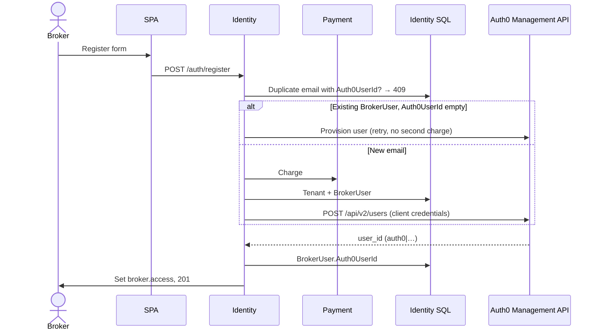
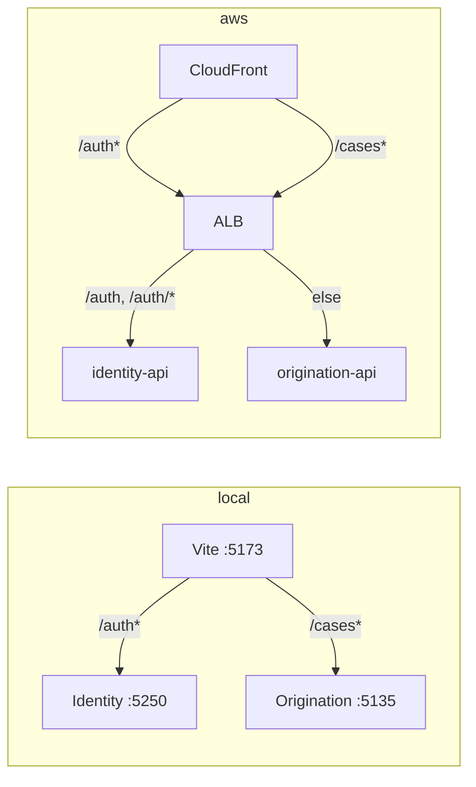

# Authentication

Auth0 proves **who the person is**. Identity owns **tenant, billing, and broker profile**, and issues the session cookie Origination already understands. The SPA never holds tokens.

| Owner | Responsibility |
|---|---|
| Auth0 | Passwords, MFA, lockout, reset, Universal Login, (later) SSO |
| Identity | `Tenant`, payment, `BrokerUser`, Auth0 user provisioning, `broker.access` |
| Origination | Case access using `tenant_id` / broker id from `broker.access` |
| SPA | Redirect to Identity for login/logout; `GET /auth/me` for UI state |

Auth0 **Organizations** are not used yet. Tenancy lives in Identity SQL (`Tenant` + `BrokerUser.TenantId`). Organizations can be added later (one Auth0 org per brokerage, `organization` on `/authorize`).

---

## Auth0 tenant objects

Four artefacts. Do not collapse them into one “app”.

| Object | Type | Used by | Purpose |
|---|---|---|---|
| **Broker Platform App** | Regular Web Application (confidential) | Identity BFF | Authorization Code login. Client secret only on the server. |
| **Broker Identity Management** | Machine to Machine | Identity, no browser | Management API: `create:users`, `read:users`, app metadata |
| **Broker Platform API** | Resource server | Audience on `/authorize` | Identifier `https://api.broker-platform.com`. Not an HTTP service. |
| **Username-Password-Authentication** | Database connection | Universal Login | Sign-ups **disabled**; Identity creates users after payment |

The Regular Web App must be allowed to request the Broker Platform API (user-delegated access / API grant). The M2M app must **not** be a client of Broker Platform API; it only calls Auth0 Management API.

Login Experience for the BFF app must be **Individuals** (not Business Users). Business Users requires `organization` on `/authorize`, which this code does not send.

### Callbacks (browser origin, not Kestrel)

| | Local | Production |
|---|---|---|
| Login URI | `http://localhost:5173/login` | `https://<cloudfront>/login` |
| Callback | `http://localhost:5173/auth/callback` | `https://<cloudfront>/auth/callback` |
| Logout / web origin | `http://localhost:5173` | `https://<cloudfront>` |

Never use `localhost:5250`. Vite and CloudFront proxy `/auth*` to Identity so cookies stay on the SPA origin.

---

## Two cookies

| Cookie | When | Role |
|---|---|---|
| Correlation / nonce (`.AspNetCore.Correlation.*`) | `Challenge("Auth0")` | Tie Auth0 callback to this browser. Middleware only. |
| `broker.oidc` | After `/auth/callback` succeeds | Short handshake: Auth0 claims. Dropped on `/auth/complete`. |
| `broker.access` | After complete (or register) | HMAC JWT, 8 hours, httpOnly, `SameSite=Lax`. What APIs trust. |

`broker.access` claims: `sub` / name identifier = broker id, `tenant_id`, `email`. Issuer `identity`, audience `broker-platform` (not the Auth0 API identifier). Signing key is `Jwt:Key` / `origination/dev/jwt`.

Default authentication remains JWT Bearer (`AddBrokerJwtAuthentication`). OIDC is an extra scheme used only for `Challenge("Auth0")` and `/auth/callback`.

---

## Configuration

ASP.NET maps `Auth0__*` env vars to `Auth0:*`.

| Key | Where | Notes |
|---|---|---|
| `Auth0:Domain` | ECS env | Hostname only, e.g. `dev-….us.auth0.com` |
| `Auth0:Audience` | ECS env | `https://api.broker-platform.com` |
| `Auth0:ClientId` | ECS env | Regular Web App |
| `Auth0:ClientSecret` | Secrets Manager `identity/dev/auth0-bff` | BFF |
| `Auth0:ManagementClientId` | ECS env | M2M app |
| `Auth0:ManagementClientSecret` | Secrets Manager `identity/dev/auth0-mgmt` | M2M |
| `Auth0:AppBaseUrl` | ECS env | SPA origin (5173 or CloudFront). Required at startup. |
| `Auth0:DatabaseConnection` | default | `Username-Password-Authentication` |

Local: `dotnet user-secrets` for both client secrets; non-secrets in `appsettings.Development.json`.

Terraform: `api/infra/identity_ecs.tf` (env + secrets), `api/infra/secrets.tf`, execution role `GetSecretValue`. GitHub Actions does **not** set ECS env; `terraform apply` registers a new task definition. `force-new-deployment` only restarts the current revision.

---

## Sign in (Auth0)

The SPA must **navigate**, not `fetch`. Identity returns 302 to Auth0.

```mermaid
sequenceDiagram
    actor Broker
    participant SPA as SPA (5173 / CloudFront)
    participant Identity as Identity API
    participant Auth0
    participant DB as Identity SQL

    Broker->>SPA: Sign in
    SPA->>Identity: GET /auth/login (full navigation)
    Identity->>Identity: Challenge Auth0; correlation cookies
    Identity->>Broker: 302 Auth0 /authorize<br/>redirect_uri = AppBaseUrl/auth/callback<br/>audience = Broker Platform API

    Broker->>Auth0: Universal Login
    Auth0->>Broker: 302 AppBaseUrl/auth/callback?code=
    Broker->>SPA: GET /auth/callback
    Note over SPA: Vite or CloudFront proxies /auth* to Identity
    SPA->>Identity: GET /auth/callback
    Note over Identity: OpenIdConnect middleware (no controller action)
    Identity->>Auth0: code + BFF client secret → tokens
    Auth0->>Identity: ID token (email, sub)
    Identity->>Identity: Sign in broker.oidc
    Identity->>Broker: 302 /auth/complete

    Broker->>Identity: GET /auth/complete
    Identity->>Identity: Read email/sub from broker.oidc
    Identity->>Identity: Drop broker.oidc
    Identity->>DB: BrokerUser by Auth0UserId then email
    alt User exists
        Identity->>Identity: Issue HMAC JWT
        Identity->>Broker: Set broker.access, 302 AppBaseUrl/
    else No BrokerUser
        Identity->>Broker: 302 AppBaseUrl/register
    end
```

### Who does what

| Step | Where |
|---|---|
| `GET /auth/login` → `Challenge("Auth0")` | `AuthController.Login` |
| Correlation cookies, 302 to Auth0, `redirect_uri` + `audience` | OpenIdConnect middleware (`CallbackPath = /auth/callback`, `OnRedirectToIdentityProvider`) |
| Code exchange, ID token, `broker.oidc` | Middleware on `/auth/callback` — **no** `[HttpGet("callback")]` |
| Map Auth0 → SQL → `broker.access` | `AuthController.Complete` + `CompleteAuth0LoginHandler` |
| SPA `window.location.assign("/auth/login")` | `beginLogin()` in `client/src/api/identity.ts` |

`AppBaseUrl` is the browser origin so Auth0 and `Set-Cookie` are not bound to port 5250 / ECS `:8080`.

---

## After login (SPA)

Auth0 is finished. Every API call sends `broker.access` via `credentials: "include"`. No `Authorization` header, no Auth0 SDK.

```mermaid
sequenceDiagram
    participant Browser
    participant SPA
    participant Identity
    participant Origination

    Note over Browser: broker.access already set

    Browser->>SPA: GET / (full page after complete redirect)
    SPA->>Identity: GET /auth/me
    Identity->>Identity: JWT from cookie broker.access
    Identity-->>SPA: tenantId, brokerId, email
    SPA->>SPA: setUser; ProtectedRoute allows app

    SPA->>Origination: GET /cases (same cookie)
    Origination->>Origination: same JWT → JwtCurrentBroker
    Origination-->>SPA: cases for that tenant
```

`AuthProvider` calls `getMe()` on mount. 401 clears React Query user state; the next Sign in is `GET /auth/login` again.

Password `POST /auth/login` still exists on the API; the SPA does not use it.

---

## Sign out

```mermaid
sequenceDiagram
    actor Broker
    participant SPA
    participant Identity
    participant Auth0

    Broker->>SPA: Sign out
    SPA->>Identity: GET /auth/logout (full navigation)
    Identity->>Identity: Delete broker.access; sign out broker.oidc
    Identity->>Broker: 302 Auth0 /v2/logout?returnTo=AppBaseUrl
    Auth0->>Broker: 302 AppBaseUrl
```

`fetch POST /auth/logout` would not complete federated logout; Auth0 SSO would silently log the user in next time. `beginLogout()` uses `window.location.assign`.

`returnTo` must be listed in Auth0 Allowed Logout URLs.

---

## Register (payment + Auth0 user)

Universal Login cannot self-register (Disable Sign Ups). After a successful charge, Identity creates the Auth0 user with the **M2M** client.



If Auth0 fails after SQL, register returns **503** (`IdentityProviderUnavailable`). A later register with the same email retries Auth0 only.

`HttpAuth0UserDirectory`: M2M token (`audience = https://{domain}/api/v2/`), then create user with `app_metadata.tenant_id` / `broker_id`. HTTP 409 → lookup by email and treat as success.

`CompleteAuth0LoginHandler` prefers `Auth0UserId` (`sub`), then email.

---

## Same-origin proxy

There is no CORS for auth in production. The browser always talks to the SPA host.



---

## Endpoints

| Method | Path | Auth | Notes |
|---|---|---|---|
| POST | `/auth/register` | Anonymous | Payment + SQL + Auth0 user; sets `broker.access` |
| GET | `/auth/login` | Anonymous | OIDC challenge |
| GET | `/auth/callback` | Middleware | Code exchange; not a controller |
| GET | `/auth/complete` | `broker.oidc` | Issue `broker.access`; redirect to SPA |
| GET/POST | `/auth/logout` | Anonymous | Clear cookie + Auth0 logout |
| POST | `/auth/login` | Anonymous | Password login (legacy) |
| GET | `/auth/me` | `broker.access` | Session for SPA |
| * | `/cases*` | `broker.access` | Origination |

---

## Dashboard errors seen in this setup

| Auth0 error | Cause | Fix |
|---|---|---|
| Client is not authorized to access resource server | BFF app has no grant on Broker Platform API | App → API Access → Broker Platform API → user-delegated grant. Add a permission (e.g. `read:cases`) if the list is empty. |
| `organization is required` / `organization_required` | App requires Organizations | Login Experience: **Individuals**, Save. If it still fails, client `organization_usage` is `require` — set to `deny` via Management API `PATCH /api/v2/clients/{id}`. |
| Callback mismatch | `redirect_uri` not on the allow list | Must match `AppBaseUrl/auth/callback` (5173 and CloudFront). |
| Identity crash: Auth0 fields required | ECS task missing an env var | `Auth0__AppBaseUrl` must be on the **current** task definition (`terraform apply`). Secrets Manager secrets need a version. |

Revoke **Auth0 Management API** user-delegated access on the Regular Web App. Only the M2M app should call Management API.

---

## Not done

- Auth0 Organizations (one org per `Tenant`)
- Origination validating Auth0 JWTs (JWKS); still HMAC `broker.access`
- Dropping `PasswordHash` from SQL
- Auth0 SPA SDK / tokens in the browser
